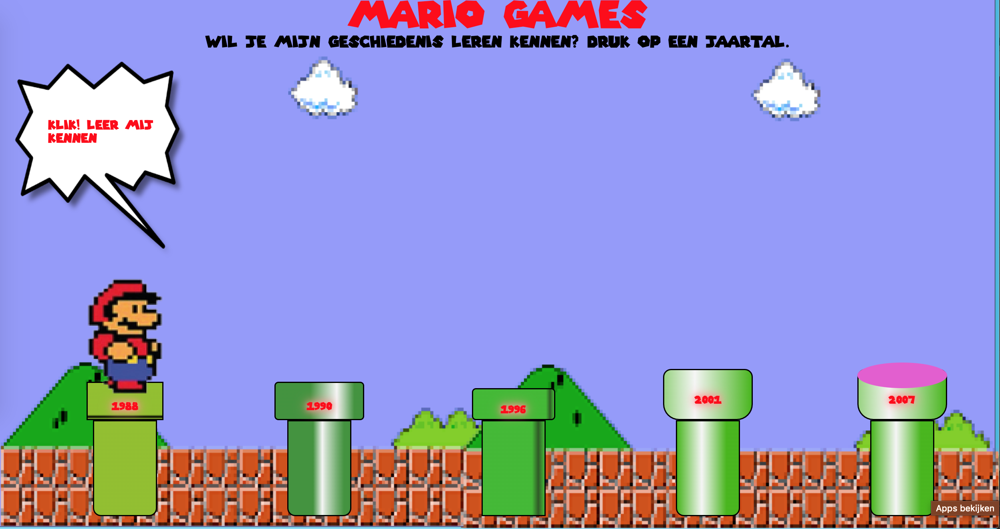
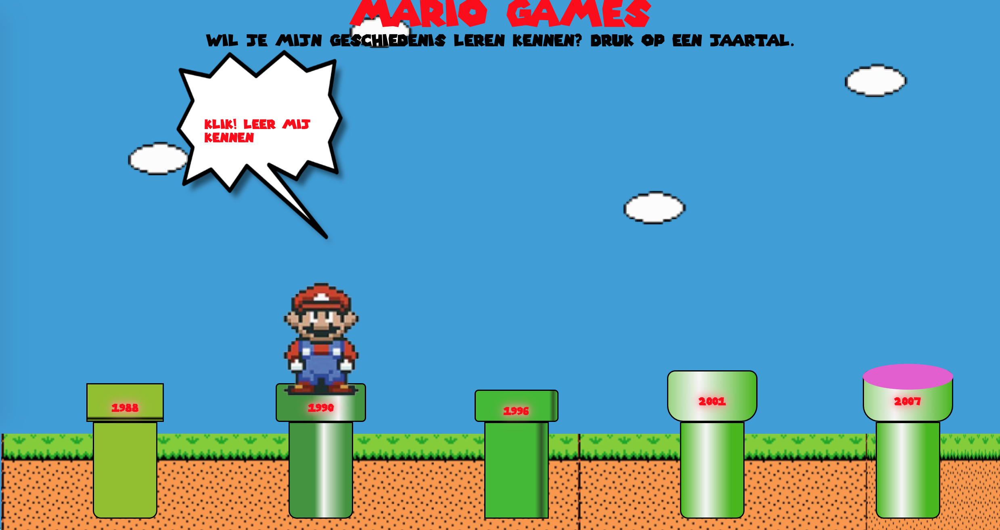
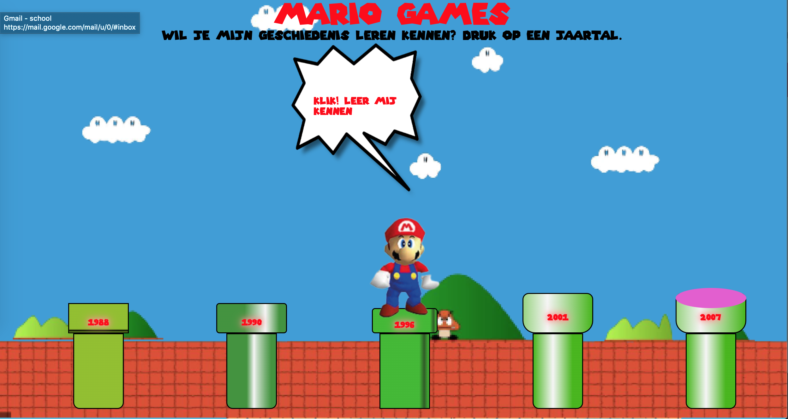
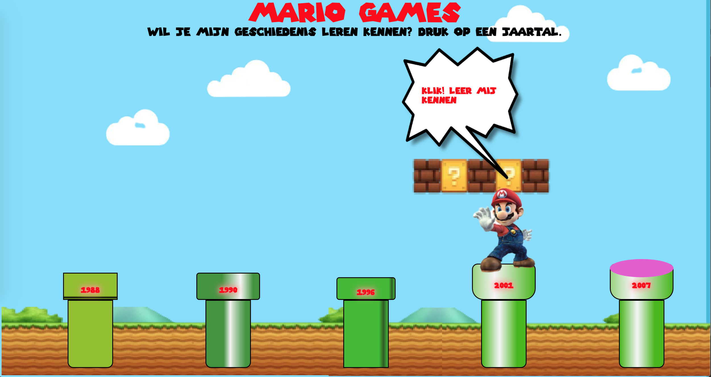
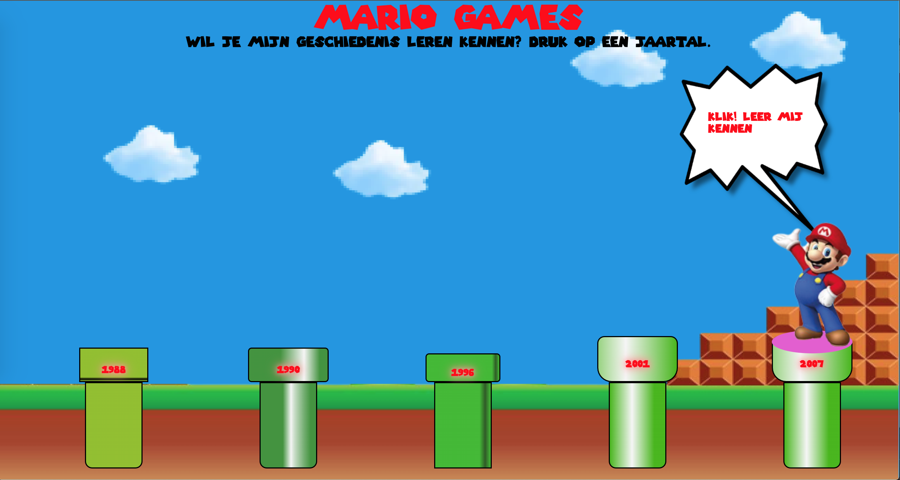

# Procesverslag

## Jij

### Ontwerper: Iriana Sutarto Hardjosusono

#### Je startniveau: blauw

# Je plan

Voor het vak interface en beweging 2 ga ik aan de slag met een timeline maken van Mario. Hierbij is het idee om mario in een game over palen te laten springen. Per paal verandert Mario van oud naar nieuw. 

  
De eerste versie/schets van je ontwerp & je persoonlijke uitdaging

  ### De eerste versie/schets:
  

  ### Je ambitie: 

  Coderen is voor mij helemaal nieuw. Ik heb met het vorige vak al kennis mogen maken, maar nu zelf echt ermee aan de slag gaan vind ik wel spannend. 
  Aan de volgende technieken/punten wil ik werken:
  

  Punt 1: Als eerste wil ik begrijpen hoe CSS, HTML en (javascript) met elkaar in verbinding staat. Ik snap het principe van code schrijven, maar hoe je het verbindt met elkaar vind ik soms lastig te snappen.

  Punt 2: Ik wil met CSS vormpjes/voorwerpen kunnen maken en deze stijlen.

  Punt 3: Ik wil code netjes kunnen maken en begrijpen hoe ik de opmaak snel kan veranderen in plaats van 1 voor 1. 

 

## Voortgang/Feedback 1

  
Mijn bevindingen + wijzigingen (minimaal 5)

  ### Bevinding 1:
  
  De eerste bevinding die ik eigenlijk al vrij snel had, was dat mijn initiele gekozen onderwerp Mario door heel veel anderen ook was gekozen. Ik vond het niet zo leuk om voor een onderwerp te gaan dat al zovaak gekozen was en merkte dat mijn ideeën bij Mario veel leken op die van anderen. Ik ben toen dan ook geswitcht van onderwerp en heb gekozen voor Mickey Mouse. Mickey Mouse is voor mij ook persoonlijker, omdat ik opgegroeid ben in een huishouden dat Disney erg leuk vind.

  De eerste bevinding ging gemakkelijk. De keuze was om uit een aantal figueren te kiezen. Ik heb vroeger veel Mario Kart gespeeld dus ik had hier al een beetje kennis van. Bij afgelopen vakken dacht ik vaak veel te moeilijk na waardoor dat proces lang duurde. Nu had ik snel een idee en ben dat gaan scheten.

  #### oplossing:
  Met het onderwerp MarioKart had ik na het internet onderzoek vrij snel een beeld van wat ik wilde gaan maken. Hierbij ben ik gaan schetsen en heb ik op papier laten zien hoe ik mijn ontwerp er uit wil laten zien. Het ontwerp is als volgt: Je hebt een tijdlijn van Mario. Het idee is om Mario in een game te laten zien dat al bestaat. Hierbij moet hij over groen balken heen springen. Ik wil Mario op de groene balken laten staan. Daarbij wil ik een achtergrond maken dat vrij neutraal is.

  ### Bevinding 2:
  Mijn schets heb ik laten zien aan mijn klasgenoot Renzo. Renzo heeft zijn mening gedeeld en hierop heb ik mijn schets ideeen aangescherpt. De eerste tip was van Renzo om de achtergrond per jaar te veranderen. Daarnaast kwam hij met het idee om wolkjes in de lucht te doen waarbij tekst en informatie wordt toegevoegd. Om duidelijk verschil te hebben is het leuk om de buizen ook aan te passen op de stijl van dat jaar. Ook zegt hij dat het leuk is om eventueel een finish van de game te laten zien.

  #### oplossing:
  Het was erg fijn om feedback te krijgen van Renzo, hij heeft mij best wat leuke ideeen gegeven om het ontwerp verder uit te werken. Wat ik meeneem in mijn verdere proces is: De achtergronden per jaar veranderen, tekstwolkjes en de verschillende buizen per jaar.

  ### Bevinding 3:
  Ik ga ontwerpen en ik begin bij de basis die ik nodig heb om alles eromheen erna goed te kunnen zetten. Dat zijn groene buizen. De buizen ga ik ontwerpen in codepen. Hierbij krijg ik uitleg en hulp van de docent. Dat is erg fijn. Daarna ben ik zelf gaan spelen hoe ik de vormen precies wil hebben.

 #### oplossing:
 Ik vond het best we lastig. Samen met de docent ben ik stap voor stap gaan kijken hoe ik dit moest aanpakken. Hierbij zijn we aan de slag gegaan met 3 div aanmaken voor de buizen. Dit zijn drie lagen waarbij ik elke laag kan aanpassen in vorm en kleur. De docent heeft de basis uitgelegd en zelf ben ik verder aan de slag gegaan met hoe ik de vormen precies wil hebben en hoe de kleuren samenstelling is.

## Voortgang/Feedback 2

  
Mijn bevindingen + wijzigingen (minimaal 5)

  
  ### Bevinding 1:
De groene buizen staan maar hoe zorg ik ervoor dat ik de Mario afbeeldingen  precies op de buizen toegevoegd krijg?

  #### oplossing:
  De afbeeldingen in heb ik toegevoegd in HTML, met behulp van leerlingen in de klas is dit zelf gelukt. 
  Toen kwam de stap om de Mario's te gaan stijlen. Ik vind het heel lastig om te bedenken hoe ik dit kan verbinden aan mijn CSS. Na zelf proberen heb ik hulp van de docent gevraagd. Toen de basis hiervoor was gelukt (bij 1 Mario) kon ik de rest ook gaan stijlen op die manier. 

  ### Bevinding 2:
 Ik wil de jaartallen in op de groene buizen zetten

  #### oplossing:
Omdat ik div heb aangemaakt en ik het precies op de buis wil heb ik als tip gekregen het daarin te zetten. Met hulp en tips van de docent heb ik dit toegevoegd.

  ### Bevinding 3:
  Ik wil een titel in het Mario font

  #### oplossing:
  Het lukte alsmaar niet om een font aan te maken. Ookal kreeg ik hulp van mijn klasgenoten, het leek alsof het font gewoon niet werkte. Ik heb dit een paar dagen gelaten want het lukte gewoon echt niet. Een paar dagen later heb ik een andere font gedownload en dit leek wel te werken. Ik ben trots dat dit helemaal alleen is gelukt. Ik merkte dat ik hierbij rustig elke stap moest uitvoeren om het voor elkaar te krijgen.

   ### Bevinding 4:
 Mijn code was niet netjes / duidelijk leesbaar

  #### oplossing:
 Omdat ik nooit codeer had ik geen idee dat het fijn was om netjes te coderen. Ik snapte niet zou goed wat dit precies inhield. Doordat Sanne mijn code ging bekijken en hij wilde snappen wat ik deed heeft hij laten zien hoe hij de code het liefste netjes ziet. Ook heb ik geleerd om sommige code's in te korten zodat je makkelijker iets kunt aanpassen. Dit was echt heel fijn want daardoor was mijn CSS een stuk korter en overzichtelijker. 

## Voortgang/Feedback 3

  
Mijn bevindingen + wijzigingen (minimaal 5)

  
  ### Bevinding 1:
  Ik wil mijn mario's uit de paal laten komen als je op het jaartal drukt

  #### oplossing:
  Toen ik hiermee aan de slag ging had ik een leuke code gevonden op internet. Het wat gelukt om dit toe te voegen en dat de mario's in het beeld sprongen. De feedback van de docent was dat het makkelijker kon met een eigen code. Samen hebben wij gewerkt aan dat mario uit de paal komt.

  ### Bevinding 2:
  Mario moet via klikken komen en weer gaan

  #### oplossing:
  Door het gebruik maken van Javascript is het gelukt om mario klikbaar te maken. Dit natuurlijk met behulp van de docent want Javascript was echt iets helemaal nieuws waar ik nog nooit mee had gewerkt. Hierbij had ik wel mijn idee hoe ik het wilde hebben. Ik wilde dat alle Mario's apart konden komen maar ook allemaal tegelijkertijd er kunnen staan. Dit is aangemaakt met de remove knop.
  Hierbij hebben we 1 aangemaakt en heb ik zelf de rest klaargemaakt.

  ### Bevinding 3:
  De achtergrond moet mee veranderen als de mario verandert

  #### oplossing:
 Hierbij heb ik ervoor gezorgt om de achtergrond mee te laten veranderen zodat het beeld compleet is. Het doel was om Mario door een tijdlijn te laten veranderen. Hierbij wilde ik ook dat de achtergrond en de setting dus zou veranderen. Dit is gelukt met met behulp van de docent. Hij heeft het uitgelegd en ik heb het bij de rest van de mario's uitgevoerd.

 ### Bevinding 4:
  De achtergrond moet mee veranderen als de mario verandert

  #### oplossing:
 Hierbij heb ik ervoor gezorgt om de achtergrond mee te laten veranderen zodat het beeld compleet is. Het doel was om Mario door een tijdlijn te laten veranderen. Hierbij wilde ik ook dat de achtergrond en de setting dus zou veranderen. Dit is gelukt met met behulp van de docent. Hij heeft het uitgelegd en ik heb het bij de rest van de mario's uitgevoerd.

  ### Bevinding 5:
 De kleuren en het formaat van de buizen moeten naar de stijl van het jaartal veranderen

  #### oplossing:
Eerst wilde ik de buizen niet veranderen. Een opmerking van de docent was dat het wel leuk was als ik de buizen met het jaartal ging aanpassen. Dat heb ik gedaan aan de hand van voorbeelden van de buizen op internet. Ik kan het nog niet goed gedetailleerd maar ik ben wel blij dat ik ze heb verandert. Ook heb ik uitgevonden hoe ik lijnen om paal kan doen waardoor het meer contrast heeft gekregen.

  ### Bevinding 5:
  Customer properties wil ik toevoegen in mijn CSS bestand

   #### oplossing:
Ik  was bezig met dit toevoegen in mijn CSS bestand. Ik weet hoe ik het moet toevoegen maar de kleuren verandere op de site heel raar waardoor ik heb besloten om het te laten. Helaas is dit onderdeel dus niet gelukt.

## Reflectie

  
Mijn eindresultaat & persoonlijke ontwikkeling

  ### Je uitkomst - karakteristiek screenshot(s):
  
  
  
  
  

  ### Dit ging goed/Heb ik geleerd: 
 Wat ik in de les al eerder heb vermeld is dat ik het langzaam aan leuker begin te vinden. Dat komt doordat ik nu beter begin te snappen hoe coderen werkt. Ik ben natuurlijk nog maar bij stap 1 maar ik ben trots dat ik wel progressie heb gemaakt.

 Wat ik heb geleerd is dat ik gewoon moet beginnen en als het niet lukt ik vragen moet stellen. 
 Vragen stellen of hulp vragen is de key to succes, althans dat is het voor mij.

 Ik had van te voren nooit gedacht dat ik (met hulp) mijn schets in werkelijkheid had kunnen brengen.

  

  ### Dit was lastig/Is niet gelukt:
  Wat niet gelukt is is dat de custom properties niet gemakkelijk te maken waren. Ik denk dat dat is gekomen door de linear gradient. Ook vind ik het toch ergens jammer dat ik zoveel hulp heb gehad van de docent omdat ik het altijd in een keer wil kunnen. Soms moet ik kleinere stapjes maken in plaats van alles tegelijkertijd willen. (Wel erg dankbaar voor de hulp, het is leuk om de basis te kunnen en te snappen)

  

## Bronnenlijst

continu bijhouden terwijl je werkt

Nb. Wees specifiek ('css-tricks' als bron is bijv. niet specifiek genoeg).

1. Buizen (Sanne)
2. Javascript (Sanne)
3. Mario in en uit poppen (Sanne)

